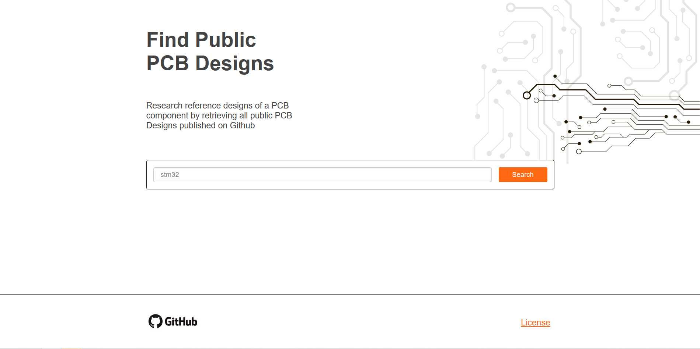
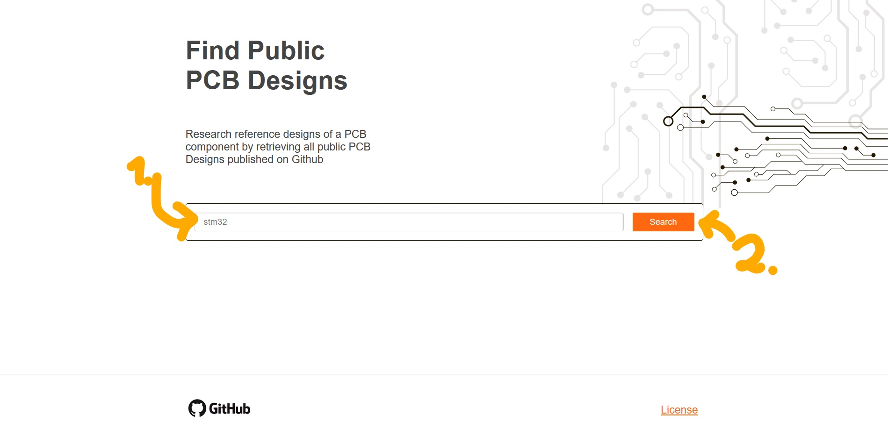
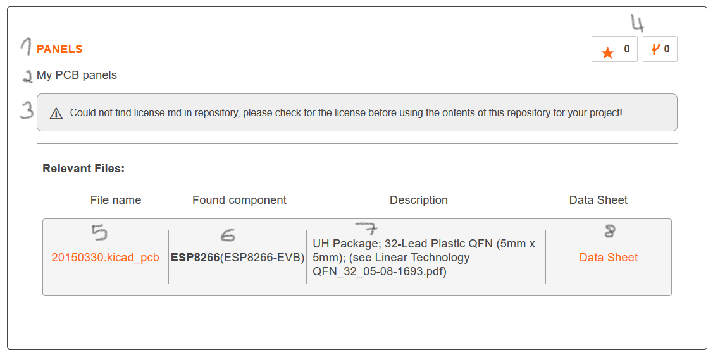

# End User Guide
In this guide, we provide information on how to use our software from an end-user perspective.

Version: 2 (21.01.2020 21:10)

## The Website
Head over to https://search-dev.aisler.net.

The page should look like this.

### Searching for a part
In the following, we explain how to search for a part using our website.

1. In the search bar, enter your search term, such as "`STM32`". 
2. Click on "Search". The engine will automatically search port repositories 
containing the searched part.

### Interpreting the results for a part
After issuing a query, our service searches out database for repositories containing the searched part. If a part was 
found, the page looks like this:

Each result tile contains:
1. Name of the Project
2. Project Description
3. Project License
4. Number of Forks and Stars of repository

List of relevant files with:
- (5) File Name and URL
- (6) Part Number (matched MPN in brackets)
- (7) Description of Part in KiCad File
- (8) Link to Datasheet (if available / part is validated)

With these information, relevant repositories can be found. With a click on the result tile, 
the user gets directed to the corresponding repository or file for further information.